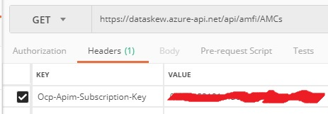
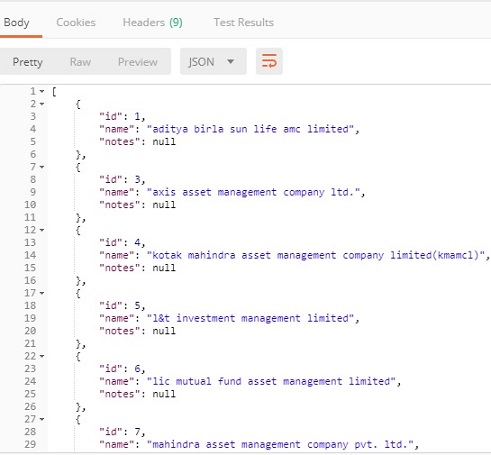
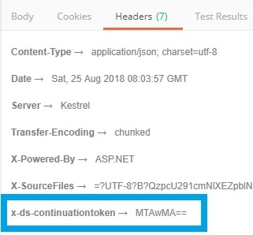
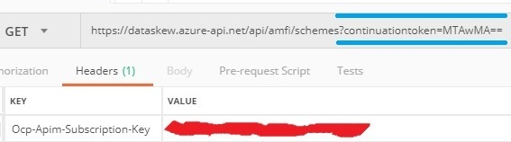
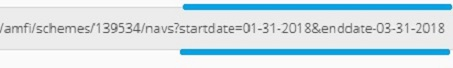

# Code Samples
@Todo

------------------------------

<br>
## Prerequisites
We're assuming that you have: 
* An active subscription to a [pricing tier](./#pricing) and a valid API key. [If not, please follow the steps here](./get-api-keys).
* You've installed tools that'll enable you to make API calls: curl or [postman](https://www.getpostman.com/) or [fiddler](https://www.telerik.com/fiddler). And that you have familiarity with those tools.

<br>
## Making your first API call
Let us start with a very simple example. 

Let's assume your subscription (and API key) gives you access to the [AMFI APIs](./apis-amfi). Say, you're interested in fetching the list of AMCs (asset management companies) registered with AMFI. 

1. Figure out the API url to call: @Todo

2. Set your API key in the request header as follows:
```
ocp-apim-subscription-key: {your api key}
```
3. Make the API call.


4. The server sends the response in JSON format.



<br>
## Usage notes

#### Headers and query parameters
Some headers and query params commonly used in DataSkew API calls are summarized below:

|Header|Purpose
|------|-------
|```ocp-apim-subscription-key```|The client specifies the API key via this header when making API calls.<br>The [section above](#making-your-first-api-call) has more details on usage. 
|```x-ds-continuationtoken```|Specifies the next chunk/page to retrieve while fetching a large collection. This header is returned by the server's response.<br>See the [paging](#paging) section below for usage details.

|Query Parameter|Purpose
|---------------|-------
|```continuationtoken```|Specifies the chunk/page to retrieve from a large collection.<br>See the [paging](#paging) section below for usage details.
|```startdate```|Specifies the start date of a time-series.<br>See the [filtering](#filtering) section below for usage details.
|```enddate```|Specifies the end date of a time-series.<br>See the [filtering](#filtering) section below for usage details.

Please note that this list is not comprehensive/exhaustive.

#### Authentication

#### Paging
Server-side paging is supported. 

* If the collection being returned has more than 1000 items, then the API returns the collection in chunks/pages of 1000 items each (note: this number is not configurable at present).

* The response headers will then contain **```x-ds-continuationtoken```**, which is a continuation token required to fetch the next chunk. Note that this token value is opaque and changes on each subsequent chunk.  


* In order to retrieve the next chunk, the client must set the **```continuationtoken```** query parameter to the value returned by the **```x-ds-continuationtoken```** header in the previous chunk:
```
?continuationtoken={value}
```

* Now make the API call. 


* If the server response again includes a **```x-ds-continuationtoken```** header, then it means that there are one or more chunks in the collection. Else, this is the last chunk. 

#### Filtering
Server-side filtering support is provided only for APIs dealing with time-series data. 

* The **```startdate```** and **```enddate```** query parameters can be used in API calls to limit the range of time-series data being extracted.


* You can use any of the following formats while specifying the **```startdate```** and **```enddate```** query parameters:

  |yyyy-MM-dd|2018-01-31
  |yyyy-MMM-dd|2018-jan-31
  |yyyy-MMMM-dd|2018-january-31
  |yyyy/MM/dd|2018/01/31
  |yyyy/MMM/dd|2018/jan/31
  |yyyy/MMMM/dd|2018/january/31
  |MM-dd-YYYY|01-31-2018
  |MM/dd/YYYY|01/31/2018
  |MMM-dd-YYYY|jan-31-2018
  |MMM/dd/YYYY|jan/31/2018
  |MMMM-dd-YYYY|january-31-2018
  |MMMM/dd/YYYY|january/31/2018

#### Sorting
At present, server-side sorting is not supported. You'll have to sort the data on the client-side.

#### OpenAPI (swagger) definitions
@Todo

<br>
## FAQs on code samples

#### Can I test the APIs without writing code (or using curl)?
Yes, you can use the API console on the DataSkew dev portal. @Todo

#### Do you also have an Java/C#/Python/JS SDK?
Not yet. Currently, we only have REST APIs. But we plan to ship SDKs in the future. Please watch this space.


<br>
_Please also check out our main [FAQs](./faqs) page._

------------------------------